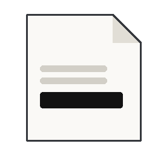

# Slate

*Slate liberates a trapped ecosystem.*

A small, capable PDF editor.
View, annotate, merge/split, redact, sign, fill forms, and scan for
sensitive content.

Built from proven libraries (PyMuPDF, pikepdf, pyHanko), not reinvented.
Made to replace Adobe Pro and other licensed tools for daily use.

The document reader and editor we always wanted.

Design rationale, library choices, and build/verification order: see [`DESIGN.md`](DESIGN.md).

## Download

Prebuilt binaries (Windows installer, Linux tarball): see
[Releases](https://github.com/devinscodex/slate/releases/latest).

## Author

Copyright © 2026 devinscodex